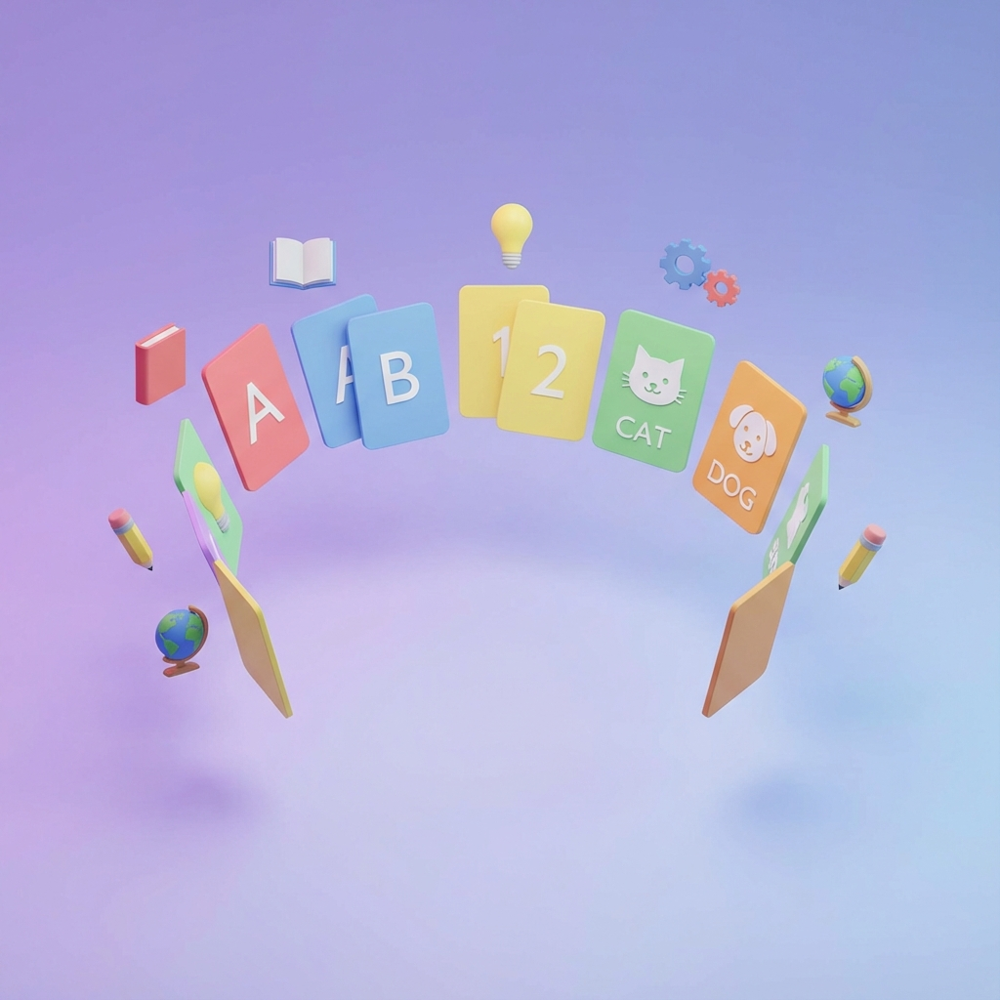

# OpenFlash ⚡️

> **Master any subject with this clean, modern, and open-source flashcard application.**

OpenFlash is a **frontend-only** learning tool built with **Vanilla JavaScript**. It is designed to be the perfect starting point for developers who want to understand how Single Page Applications (SPAs) work using standard web technologies.

<p align="center">
  
</p>

## 🌟 Features

- **📂 Deck Management**: Create, edit, and delete custom flashcard decks.
- **🧠 Smart Study Mode**: Interactive study sessions with "Good" / "Again" tracking.
- **🎨 Beautiful UI**: Modern design with glassmorphism, gradients, and smooth animations.
- **💾 Local Persistence**: All your data is saved instantly to your browser's LocalStorage. No login required.
- **🔔 Toast Notifications**: Friendly non-blocking alerts for user feedback.
- **📱 Responsive**: Works great on desktop and mobile.

---

## 🚀 Getting Started

Since OpenFlash is a static application, getting it running is super easy. You don't need to install node_modules or build anything!

### Prerequisites

All you need is a web browser (Chrome, Firefox, Safari) and a text editor (VS Code recommended).

### 1. Clone the Repository

```bash
git clone https://github.com/yourusername/openflash.git
cd openflash
```

### 2. Run the Application

You cannot just double-click `index.html` because of browser security rules (CORS) with JavaScript modules. You need a simple local server.

**Option A: Using Python (Recommended for Mac/Linux)**
```bash
# Run this inside the openflash folder
python3 -m http.server 8000
```

**Option B: Using Node.js**
```bash
npx serve
```

### 3. Open in Browser

Visit **`http://localhost:8000`** in your browser. You should see the Landing Page!

---

## 📂 Project Structure

We keep things organized but simple. Here is how the code is laid out:

```
openflash/
├── index.html          # The main entry point (loads CSS and app.js)
├── assets/             # Images and static files
├── css/                # Styling files
│   ├── style.css       # Global variables and base styles
│   ├── components.css  # Buttons, cards, and reusable UI
│   ├── landing.css     # Styles specific to the landing page
│   └── toast.css       # Styles for notification popups
└── js/                 # Application logic
    ├── app.js          # 🚦 Main Router: Decides which page to show
    ├── storage.js      # 💾 Database layer: Handles LocalStorage
    ├── toast.js        # 🔔 Notification utility
    ├── utils.js        # 🛠 Helpers: Date formatting, ID generation
    └── views/          # 🖼 Page Components
        ├── home.js     # Dashboard / Deck List
        ├── editor.js   # Create / Edit Deck Form
        ├── study.js    # Flashcard Study Interface
        └── landing.js  # Welcome Page
```

---

## 🛠 How It Works (For Developers)

OpenFlash uses a **Hash-Based Router**.
- When the URL changes to `#/create`, `js/app.js` detects the change.
- It clears the `#app` container in `index.html`.
- It imports `js/views/editor.js` and calls its `render()` function.
- The `render()` function returns a DOM element (HTML), which is appended to the page.

No build tools. No webpack. Just pure, clean JavaScript.

---

## 🤝 How to Contribute

We love beginners! If you want to add a feature or fix a bug, follow these steps:

1. **Fork** this repository (click the button in the top right).
2. **Clone** your fork to your computer.
3. **Create a Branch** for your feature:
   ```bash
   git checkout -b my-cool-feature
   ```
4. **Make Changes**. Try changing colors in `css/style.css` or adding a new message in `js/views/home.js`.
5. **Test** your changes by running the local server.
6. **Commit and Push**:
   ```bash
   git add .
   git commit -m "Added a cool feature"
   git push origin my-cool-feature
   ```
7. **Open a Pull Request** on GitHub.

### Ideas for Contributions
- [ ] Add a "Night Mode" toggle.
- [ ] Allow export/import of decks as JSON files.
- [ ] Add sound effects when flipping cards.
- [ ] Improve the mobile layout for the study screen.

---

## 📄 License

This project is open source and available under the [MIT License](LICENSE).

---

> Built with ❤️ by the OpenFlash Community.
